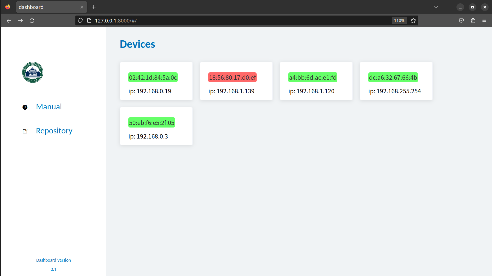

# cryptojacking detection dashboard

A demo, on developing.

## Introduction

example:


## Deploy

TODO

## How to run in developing environment

in `dashboard/`:

```shell
python manage.py runserver --noreload
```