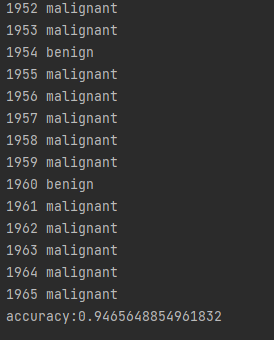
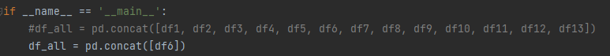

分类器：
（1）使用的模型为逻辑回归，这个版本没有和抓包整合，我放入的测试数据是“malicious/Raspberry_WebminePool_Aggressive.csv”，也就是一个全为恶意的数据集，直接运行可以看到结果。这个结果的含义是第n组的分类结果是恶意还是非恶意，注意并不是每条数据的分类结果，而是每一组（10条数据）的分类结果。最后是准确率，这个在实际对抓包数据进行分类时无法计算，由于目前使用的是全恶意的数据集，因此可以得到具体的准确率。

（2）如果想更换测试集的话可以下图的位置修改“pd.concat()”当中的内容，其中df1到df7都是全恶意的数据集，可以使用单个也可以多个，数据越多越慢。（注意不要使用全无害的数据集进行测试，由于我们的best features命名会出问题，但并不影响实际抓包时的分类）

（3）未来使用抓包的数据进行分类时，最好先垫一些数据，如df6的数据。因为经过我们的测试输入的数据越多，分类的结果越准确，比如“malicious/Server_WebminePool_Aggressive.csv”的数据较少，准确率为84%，而更大一些的如“malicious/Raspberry_WebminePool_Aggressive.csv”的准确率为94%。这是由于实际在提取特征，计算best features时，会使用所有的数据，先按照时间戳进行排序，然后以10条数据为1组计算数据包长度的时间序列特征，当数据集较大时，best features的结果也越易于进行分类。

（4）目前输入需要是.csv格式，我在实际的抓包程序中也将流量都存到了.csv文件里，这个没有问题。然后垫哪些数据这个需要取舍一下，如果提前放入的数据较少，运行起来会很快，抓包代码的速度差不多是3到5秒存入1组（10条数据）；如果要考虑准确率，多垫一些数据，可能每次计算要30秒，就跟不上抓包的速度。这个后面讨论一下。